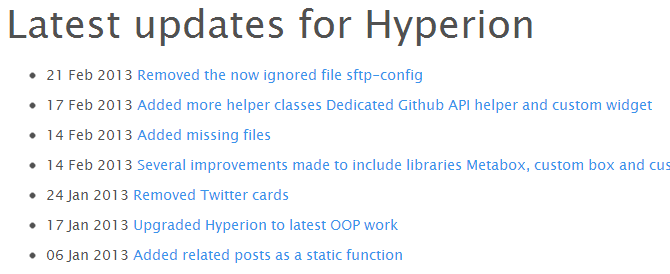
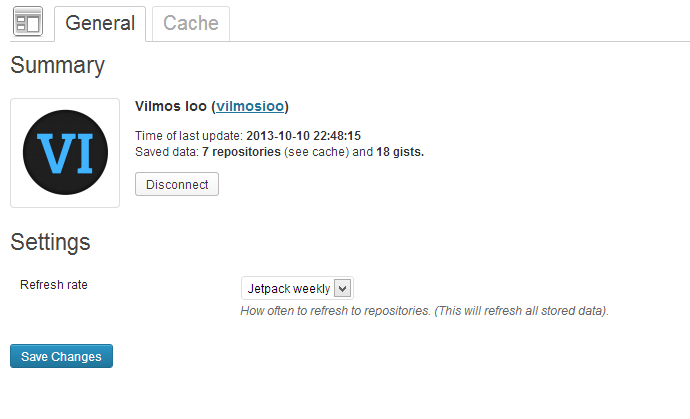
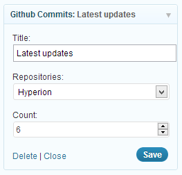
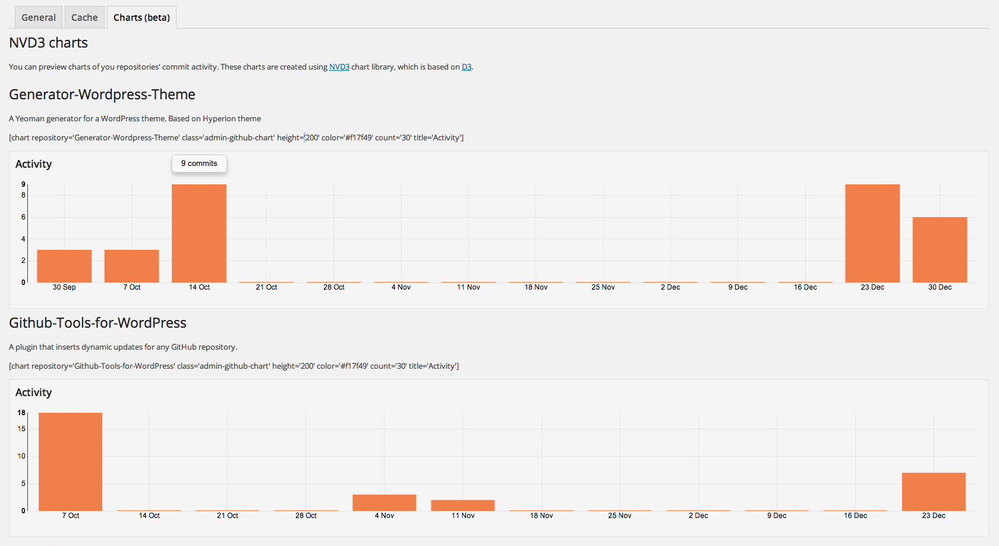

# WP GitHub Tools

A plugin that inserts dynamic updates for your GitHub repositories. 

## Description

Use the custom GitHub Commit widget to display a list of the latest updates from a repository. Additionally, you can use shortcodes to add commit lists or embed any gist. 
The plugin will cache the GitHub response for a certain time period. You can change this value to any wordpress schedules you have isntalled (default: hourly, half-day, daily). To get more time frames you will need an additional plugin that extends the cron schedules.

### Shortcodes

**[gist id='*gist_id*' ]** Embeds a gist in your post

 - *id* (required) The id of the gist you want to embed. 

**[commits repository='your-repository' count='max-count' title='your-title']** Displays the latest commits from your repository

- *repository* (required) The name of the repository you wish to get. 
- *count* (optional) The number of commits to retrieve (order by date). Default: 5
- *title* (optional) A title to display before the list (*h2*). Default: none

**[chart repository='your-repository' width='chart-width' height='chart-height' class='additional-css-classes' color='bar-color' background='chart-background' count='commit-count' title='your-title']** Displays an activity chart for the given repository.

- *repository* (required) The name of the repository you wish to get. 
- *width* (optional) The width of the chart. Default: auto
- *height* (optional) The height of the chart. Default: auto
- *class* (optional) Additional CSS classes to add to the chart element. Default: ''
- *color* (optional) The chart bar colors. Must be a valid color string (rgb, hex or name). Default: '#f17f49'
- *background* (optional) The chart background color. Must be a valid color string (rgb, hex or name). Default: 'transparent'
- *count* (optional) The number of commits to retrieve (order by date). Default: 30
- *title* (optional) A title to display before the list (*h2*). Default: none

### PHP functions

Feel free to use the Gihub helper class in your theme or plugin development.

`<?php WP_Github_Tools_API::get_repos($user, $access_token); ?>`

`<?php WP_Github_Tools_API::get_user($user, $access_token); ?>`

`<?php WP_Github_Tools_API::get_commits($repo, $user, $access_token); ?>`

`<?php WP_Github_Tools_API::get_gists($user, $access_token); ?>`

### Contribute!

If you have suggestions for a new add-on, feel free to email me at ioo.vilmos@gmail.com. Alternatively, you can fork the plugin from [Gihub](https://github.com/vilmosioo/Github-Tools-for-WordPress)

Or follow updates on [Twitter](http://twitter.com/vilmosioo)!
 
### Installation

 1. Download the plugin files and upload them to your `/wp-content/plugins/` directory
 2. Activate the plugin through the 'Plugins' menu in WordPress
 3. Create a Github application (make sure the redirect url points back to the github tools settings page)
 4. Add your client ID and secret
 5. Connect to Github
 6. Ready to go!

### Screenshots

Commits shortcode in action. An un-onrdered list of the latest commits is displayed, that you can style as you please using CSS.

 

The settings page once you are connected to Github.

 

The commits widget that you can use on any sidebar to deliver live updates for your projects.

 

The cache preview system. You can manually refresh the cached data and you can view examples for the commits shortcode. 

 

The chart preview system. Currently in beta. 

 

### Changelog
	
*1.2 30 December 2013*
 * Added Chart functionality (beta) that allows users to display their commit activity using a graph.
 * Enabled automatic build to deliver updates more quickly.
 * Minifying assets for greater performance.

*1.1 10 October 2013*
 * Using OAuth to connect to Github
 * Improved settings page
 * Better caching system 

*1.0 20 February 2013*
 * Added custom widget to display repository commits.
 * Implemented custom shortcode to display repository commits.
 * Implemented custom shortcode to embed gists.
 * Customizable cache system.
 * Live validation of GitHub usernames.
